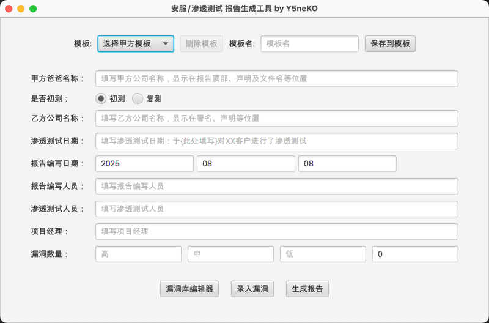
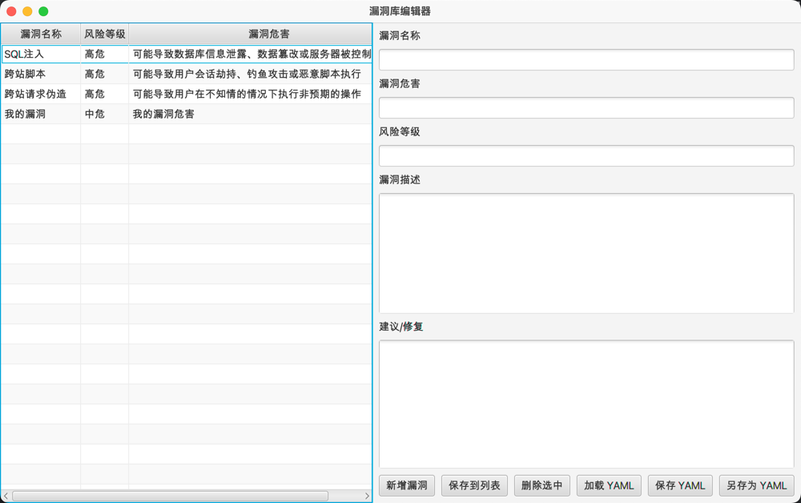
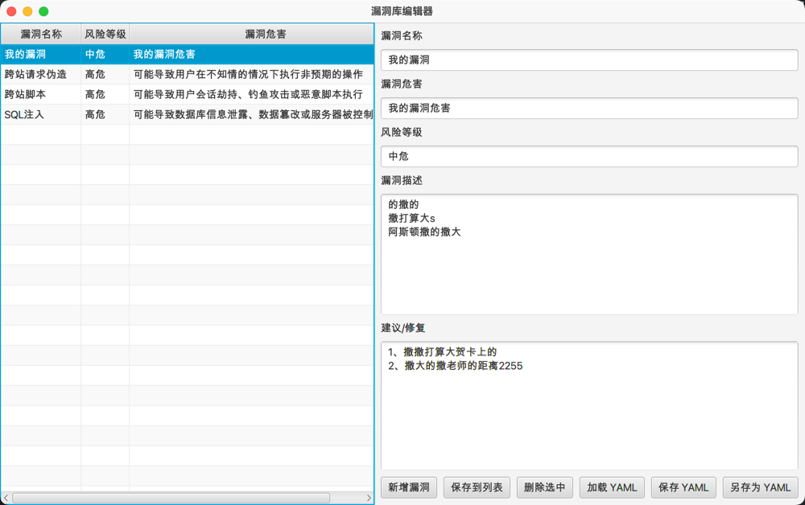
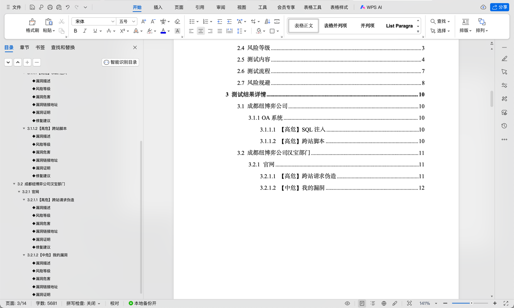

# SSReportTools - 安服/渗透测试 报告生成工具

基于JavaFx开发的图形化安服/渗透测试报告自动生成工具，安服渗透仔摸鱼划水必备。

## Preface

众所周知，写一个报告花的最多的时间不是在写测试过程上，而是复制粘贴每个漏洞描述、危害、修复建议的固定格式上；

本工具通过占位符和简单的openxml格式解析替换来快速生成报告，节省每天抠格式的时间，可以花更多时间 ~~摸鱼划水~~ 提升自己🐶

## Env

`JDK 8`

## Features

- 自动生成安服/渗透测试报告
- 漏洞库编辑
- 自定义报告模板制作

## TODO

- 批量生成报告

## Install

1. 下载最新版本压缩包
2. 解压文件
3. 运行 `SSReportTools.jar` 即可

## Example

### 主界面



### 自定义漏洞库



### 漏洞录入



### 生成报告


### 制作报告模板



## Extended

### 制作报告模板

#### 模板制作流程

1. **上传Word模板文件**：点击"选择Word模板文件"按钮，上传包含占位符的Word文档（.docx格式）

2. **修复占位符格式**：点击"修复占位符"按钮，自动将Word文档中的占位符部分元数据替换为符合规范的格式，这一步是为了修复手动编辑的占位符会被WPS或WORD在元数据中拆分成多个段的问题

3. **提取标题组件**：点击"提取漏洞详情主体标题"按钮，自动提取文档中的各级标题组件
   - 一级标题：单位名称
   - 二级标题：系统名称
   - 三级标题：漏洞名称
   - 四级标题：漏洞详情
   - 正文文本：普通段落文本

4. **保存样式模板**：为模板命名并点击"保存样式模板"完成制作

#### 占位符Word文档格式规范


#### 模板文件结构

制作的报告模板会保存在以下目录结构中：

```
config/
├── report_templates/           # 报告模板
│   ├── default-components/     # 默认组件目录
│   └── user-components/        # 用户自定义组件目录
└── report_components/          # 标题组件模板
    ├── default-components/     # 默认标题组件
    └── user-components/        # 用户自定义标题组件
        ├── 模板名称/
        │   ├── first_level_heading.txt    # 一级标题组件
        │   ├── second_level_heading.txt   # 二级标题组件
        │   ├── third_level_heading.txt    # 三级标题组件
        │   ├── fourth_level_heading.txt   # 四级标题组件
        │   └── normal_text.txt            # 正文文本组件
        └── ...
```

#### 注意事项

- 模板文件必须是标准的Word文档格式（.docx）
- 占位符格式为`{{{{{占位符名称}}}}}`
- 提取标题组件时会自动过滤目录条目（包含PAGEREF _Toc的内容）
- 每个模板对应独立的标题组件，确保报告格式的一致性
- 支持编辑和删除已保存的模板
- 基础占位符段提取后会自动删除，无需再手动删除
- MainContent占位符修复后，在WPS或WORD中打开看不见，属于正常现象

### 占位符表

占位符以`{{{{{占位符}}}}}`的形式表示，占位符内容会被替换为实际值。

| 占位符                 | 描述                                              |
|---------------------|-------------------------------------------------|
| paraId              | 随机值占位符：随机生成的标识                                  |
| TocName             | 随机值占位符：随机生成的标识                                  |
| first_heading_text  | 基础占位符：一级标题文本（单位名称）                              |
| second_heading_text | 基础占位符：二级标题文本（系统名称）                              |
| third_heading_text  | 基础占位符：三级标题文本（漏洞名称）                              |
| fourth_heading_text | 基础占位符：四级标题文本（漏洞详情）                              |
| normal_text         | 基础占位符：普通正文文本                                    |
| customer_name       | 普通占位符：客户名称                                      |
| signature_name      | 普通占位符：乙方公司落款                                    |
| is_first_test       | 普通占位符：是否首次测试                                    |
| test_time           | 普通占位符：渗透测试时间                                    |
| report_year         | 普通占位符：报告年份                                      |
| report_month        | 普通占位符：报告月份                                      |
| report_day          | 普通占位符：报告日期                                      |
| report_reporter     | 普通占位符：报告编写人员                                    |
| vul_all_count       | 普通占位符：漏洞总数                                      |
| vul_high_count      | 普通占位符：高危漏洞总数                                    |
| vul_medium_count    | 普通占位符：中危漏洞总数                                    |
| vul_low_count       | 普通占位符：低危漏洞总数                                    |
| pm_name             | 普通占位符：项目经理                                      |
| tester_name         | 普通占位符：渗透测试人员                                    |
| MainContent         | 特殊占位符：漏洞结果主内容（由所有的 单位名称>系统名称>漏洞名称>漏洞详情 构成的主要内容） |

通过占位符表，可手动快速的构建一个自己公司的报告模板。

## Contribute

欢迎各位大佬测试问题、贡献更好的方案或者拓展报告模板！

## 协议

本项目基于 MIT 协议开源
