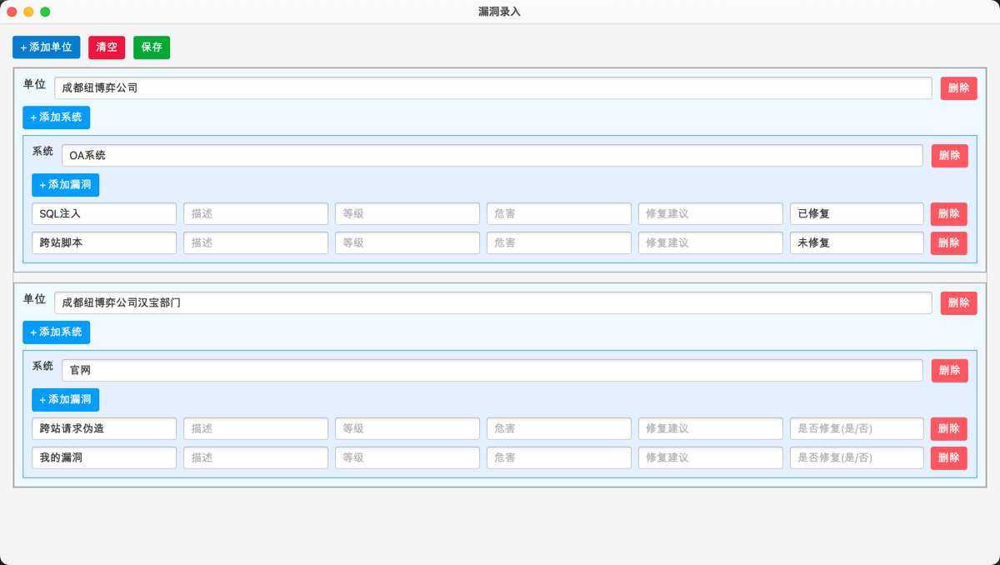

# SSReportTools - 安服/渗透测试 报告生成工具

基于JavaFx开发的图形化安服/渗透测试报告自动生成工具，安服渗透仔摸鱼划水必备。

## Preface

众所周知，写一个报告花的最多的时间不是在写测试过程上，而是复制粘贴每个漏洞描述、危害、修复建议的固定格式上；

本工具通过占位符和简单的openxml格式解析替换来快速生成报告，节省每天抠格式的时间，可以花更多时间 ~~摸鱼划水~~ 提升自己🐶

## Env

`JDK 8`

## Features

- 自动生成安服/渗透测试报告
- 漏洞库编辑

## TODO

- 自定义报告模板
- 批量生成报告

## Install

1. 下载最新版本压缩包
2. 解压文件
3. 运行 `SSReportTools.jar` 即可

## Example

### 主界面

### 自定义漏洞库

### 漏洞录入

### 生成报告

## Extended

### 占位符表

占位符以`{{{{{占位符}}}}}`的形式表示，占位符内容会被替换为实际值。

| 占位符                 | 描述                                 |
|---------------------|------------------------------------|
| paraId              | 随机生成的标识                            |
| TocName             | 随机生成的标识                            |
| first_heading_text  | 一级标题文本（相对于单位标题一级，实际上是二级标题，后面的级别同上） |
| second_heading_text | 二级标题文本                             |
| third_heading_text  | 三级标题文本                             |
| fourth_heading_text | 四级标题文本                             |
| normal_text         | 普通正文文本                             |
| customer_name       | 客户名称                               |
| signature_name      | 乙方公司落款                             |
| is_first_test       | 是否首次测试                             |
| test_time           | 渗透测试时间                             |
| report_year         | 报告年份                               |
| report_month        | 报告月份                               |
| report_day          | 报告日期                               |
| report_reporter     | 报告编写人员                             |
| vul_all_count       | 漏洞总数                               |
| vul_high_count      | 高危漏洞总数                             |
| vul_medium_count    | 中危漏洞总数                             |
| vul_low_count       | 低危漏洞总数                             |
| pm_name             | 项目经理                               |
| tester_name         | 渗透测试人员                             |
| MainContent         | 漏洞结果主内容                            |

通过占位符表，可手动快速的构建一个自己公司的报告模板，预计在后续版本实现自动解析，进一步解放双手。

## Contribute

欢迎各位大佬测试问题、贡献更好的方案或者拓展报告模板！

## 协议

本项目基于 MIT 协议开源
